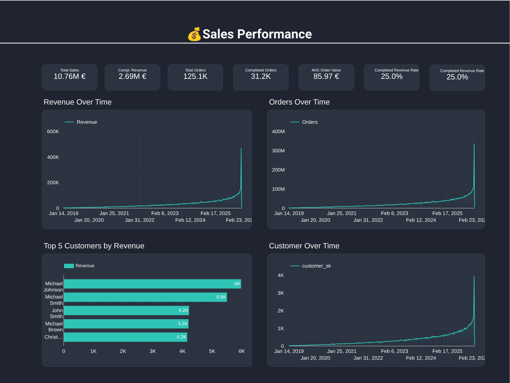
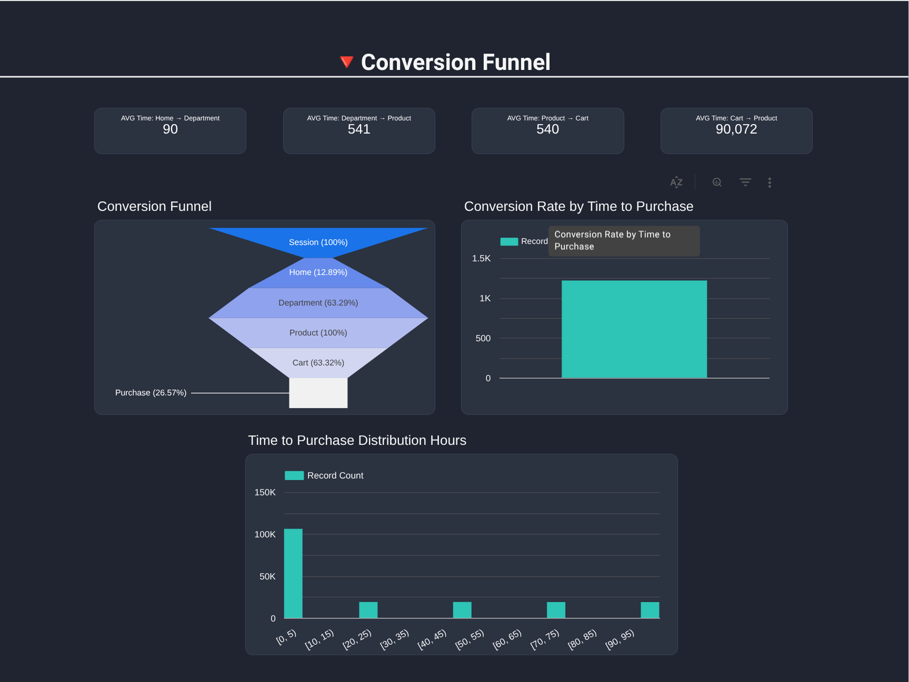
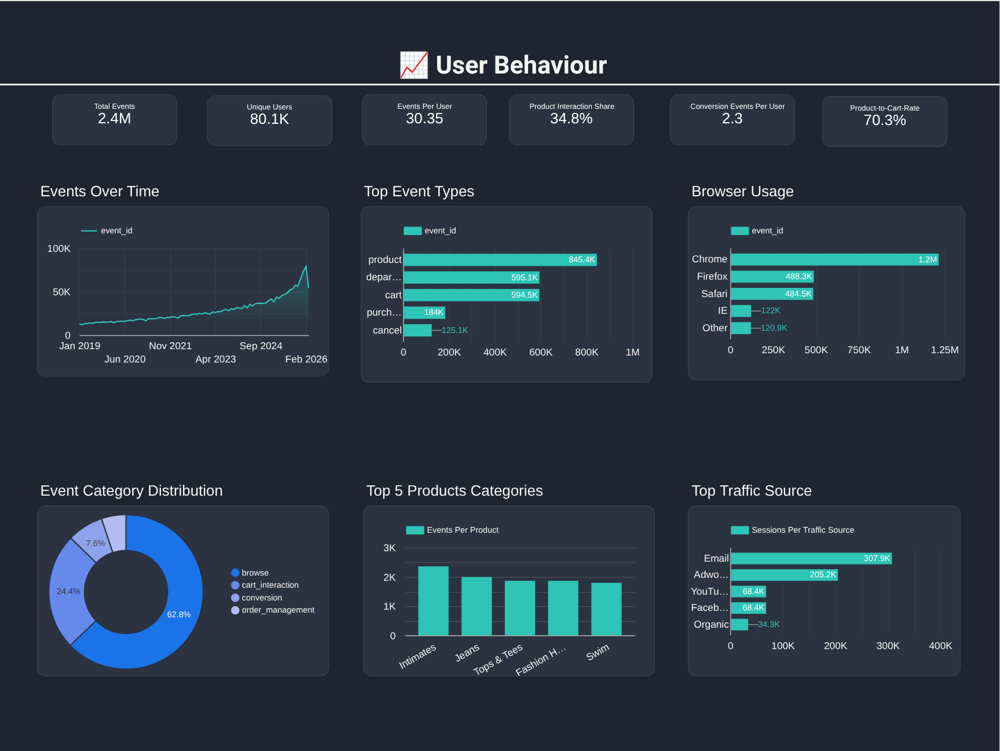
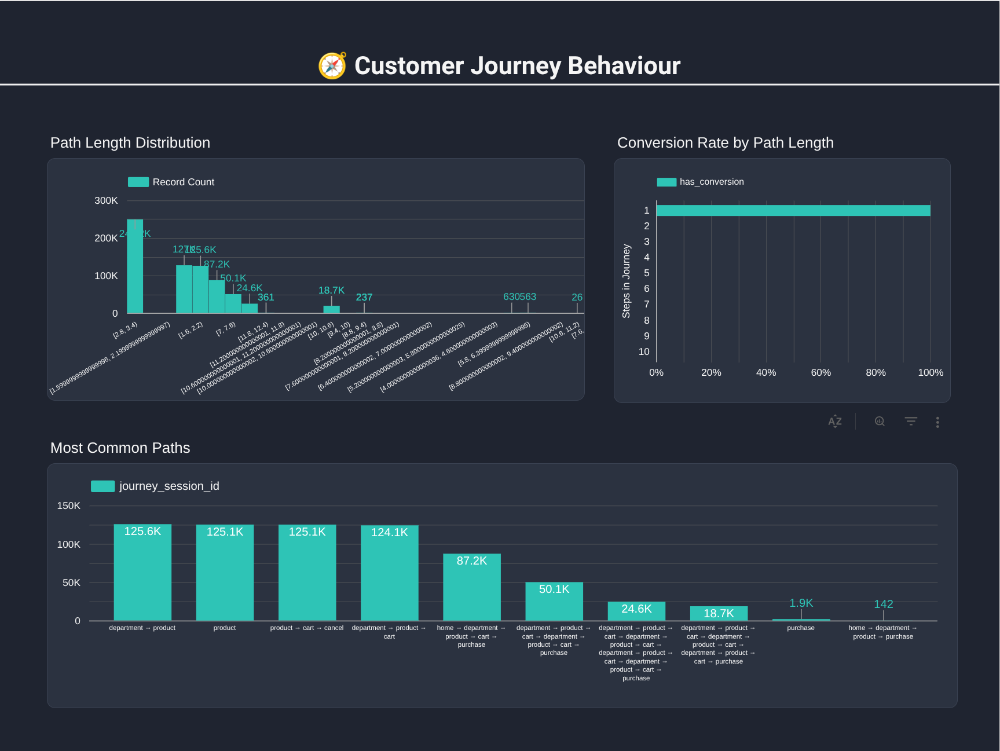
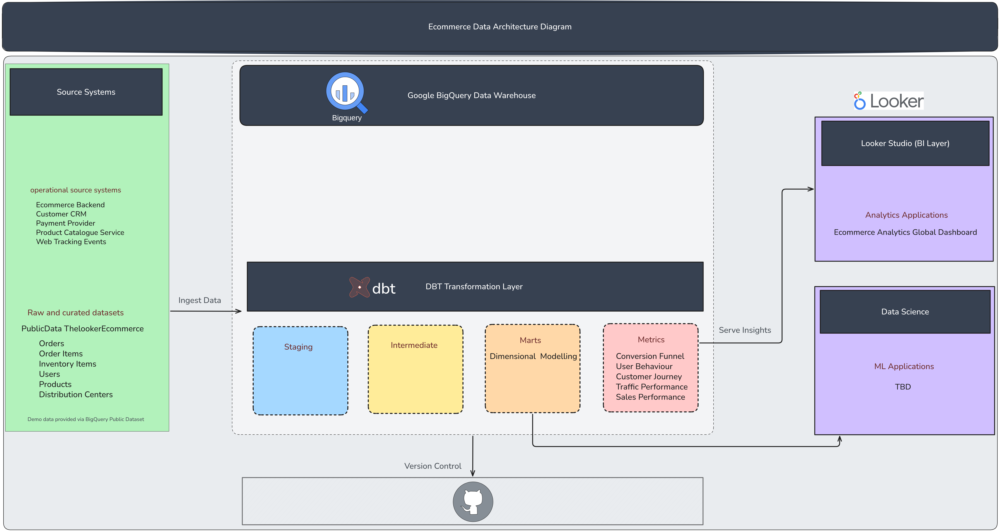

# Ecommerce Analytics Platform \| dbt + BigQuery

An end-to-end analytics engineering project demonstrating a modern data
stack using **BigQuery, dbt, GitHub, and Looker Studio**.

The project models ecommerce event and order data into a scalable
analytics warehouse and delivers business insights through interactive
dashboards.

------------------------------------------------------------------------

### Live Dashboard

View the interactive dashboard here:

https://lookerstudio.google.com/reporting/9a0969ec-7a63-4104-9e8a-1d7e232b5c8c

------------------------------------------------------------------------

# Dashboard Preview

### Sales Performance Dashboard

------------------------------------------------------------------------

### Conversion Funnel Dashboard

------------------------------------------------------------------------

### User Behaviour Dashboard

------------------------------------------------------------------------

### Customer Journey Analysis

------------------------------------------------------------------------

# Architecture

Below is the high-level architecture of the analytics platform.

------------------------------------------------------------------------

# Tech Stack

  Layer                   Tool
  ----------------------- ---------------
  Data Warehouse          BigQuery
  Transformation          dbt
  Version Control         GitHub
  BI / Analytics          Looker Studio
  Architecture Diagrams   Excalidraw

------------------------------------------------------------------------

# Data Platform Architecture

The pipeline follows a modern analytics engineering architecture.

Source Systems → BigQuery Raw Dataset → dbt Transformation Layer →
Analytics Mart → Looker Dashboards

### dbt Transformation Layers

**Staging Layer** - Standardises raw source tables - Renames columns -
Applies consistent data types

**Intermediate Layer** - Sessionisation - Event cleaning - Order
enrichment

**Mart Layer** - Fact tables for analytics - Dimensional modelling -
Business metrics

------------------------------------------------------------------------

# Key Models

### Fact Tables

-   fct_orders
-   fct_events
-   fct_sessions
-   fct_funnel_time_to_steps
-   fct_session_funnel_steps
-   fct_session_funnel_steps

### Dimension Tables

-   dim_customers
-   dim_products
-   dim_dates

------------------------------------------------------------------------

# Analytics Use Cases

### Revenue & Sales Analytics

-   Revenue over time
-   Average order value
-   Top customers by revenue

### Customer Behaviour

-   Session activity
-   Event tracking
-   Conversion analysis

### Funnel Analysis

-   Time between funnel steps
-   Drop-off points

------------------------------------------------------------------------

# Data Engineering Features

### dbt Features

-   Incremental models
-   Model contracts
-   Source freshness monitoring
-   Automated testing
-   CI pipeline
-   Scheduled production jobs

### Performance Optimisation

-   Partitioned fact tables
-   Clustered query keys
-   Query plan inspection

------------------------------------------------------------------------

# Repository Structure

models/ staging/ intermediate/ marts/

docs/ architecture-diagram.png ecommerce_sales_performance.png
ecommerce_conversion_funnel.png ecommerce_user_behaviour.png
customer_journey_behaviour.png

macros/ tests/

------------------------------------------------------------------------

# Future Improvements

-   Data quality monitoring dashboard
-   Anomaly detection for key metrics
-   Feature tables for ML models (LTV / churn)

------------------------------------------------------------------------

# Author

**Milo Carlos Lee**

Analytics Engineering Portfolio Project
